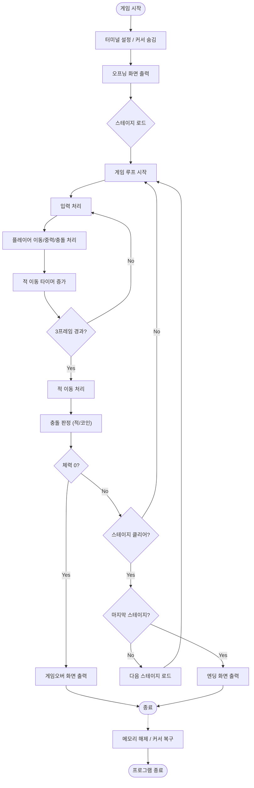

Project Repository: [https://github.com/woohyun212/ADS-Nuguri](https://github.com/woohyun212/ADS-Nuguri)  
Slide: [figma Link](https://www.figma.com/deck/mmcRry8XoNioa2ufBSbR23/%EB%B0%9C%ED%91%9C%EC%9E%90%EB%A3%8C?node-id=1-30&t=VlvvWtRG63GqLLYr-1)
---

# ADS-Nuguri
고급자료구조 팀과제

---

## 팀소개
||||
|:-:|:-:|:-:|
|박아정|박우현|이준서|
|20243103|20213097|20223129|

---

## OS별 컴파일 및 실행 방법 가이드

- gcc compiler 기준으로 안내한다.

### 3.2 Windows (gcc / MinGW 기준)

#### (1) 직접 컴파일

MinGW-w64 또는 유사한 gcc 환경에서:

```PowerShell
gcc -std=c99 -Wall -o nuguri.exe nuguri.c
nuguri.exe
```

PowerShell 기준:

```powershell
gcc -std=c99 -Wall -o nuguri.exe nuguri.c
.\nuguri.exe
```

#### (2) Makefile 사용

```powershell
# 빌드
make          # 또는 mingw32-make 등 환경에 맞는 make 명령

# 실행
.\nuguri.exe

# 정리 및 재빌드
make clean
make          # 또는 make clean_build
```

> `Makefile`에서 기본 `TARGET`은 `nuguri`으로 정의되어 있으며,  
> Windows에서는 실행 시 `.exe` 확장자가 붙는다.

---

### 3.3 Linux

#### (1) 직접 컴파일

```bash
gcc -std=c99 -Wall -o nuguri nuguri.c
./nuguri
```

#### (2) Makefile 사용

`Makefile`은 OS를 감지하여 Linux인 경우 별도의 타깃 이름을 사용하도록 설정되어 있다.

```bash
# 빌드
make          # HOST_OS=Linux 인 경우 TARGET=nuguri 으로 설정됨

# 실행
./nuguri     # 또는 Makefile에 설정된 TARGET 이름

# 정리 및 재빌드
make clean
make          # 또는 make clean_build
```

---

### 3.4 macOS

#### (1) 직접 컴파일

gcc가 설치 후

```bash
gcc -std=c99 -Wall -o nuguri nuguri.c
./nuguri
```

#### (2) Makefile 사용

```bash
make         # HOST_OS=macOS 로 인식됨
./nuguri   # 또는 Makefile에서 지정한 TARGET

# 정리 및 재빌드
make clean
make         # 또는 make clean_build
```

---

## 구현 기능 리스트 및 게임 스크린샷

### 구현 기능 리스트

1. 동적 맵 로딩 및 적과 코인 등 Stage Object 자동 인식 기능 구현
2. 스폰 위치 저장 및 리스폰 시스템 구현 (체력 및 점수 패널티 적용)
3. 체력(하트 UI) 시스템 도입 및 게임오버 화면 연출 추가
4. 코인 획득 판정 및 점수 반영 로직 개선 (효과음 추가)
5. 화면 버퍼링을 통한 깜빡임 최소화 및 출력 최적화
6. 적 이동 속도 제어를 통해 게임 난이도 조절 기능 추가
7. 캐릭터 및 객체 색상 출력으로 시인성 강화
8. 입력 처리 방식 개선 및 Crossplatform(Windows/Linux/macOS 환경) 지원
9. 오프닝/엔딩 화면 및 커서 제어 등 UX 향상 요소 추가
10. 동적으로 할당된 메모리 해제 루틴 구현으로 메모리 자원 관리 안정성 강화 

---

### 게임 스크린샷 

<!-- 게임 스크린샷 캡쳐하여 추가-->

|빌드 & 오프닝|플레이|
|:-:|:-:|
|||
|게임 클리어|게임 오버|
|||

---

## OS 호환성 문제 및 해결 과정

### 1) Windows에서 빌드/실행 불가(헤더, API 차이)
- 문제: 기존 코드는 `<unistd.h>`, `<termios.h>`, `<fcntl.h>` 및 `tcsetattr/tcgetattr`, `usleep` 등에 의존하여 Windows 환경에서 컴파일이 되지 않음.
- 원인: 터미널 제어(termios)와 POSIX 계열 API는 Windows 기본 콘솔 환경과 호환되지 않음.
- 해결: `#ifdef _WIN32` 조건부 컴파일을 도입하여 OS별로 필요한 헤더와 구현을 분리함.
  - Windows: `<windows.h>`, `<conio.h>` 사용
  - Linux/macOS: `<unistd.h>`, `<termios.h>`, `<fcntl.h>` 유지

### 2) 키보드 입력 처리 방식의 OS 차이
- 문제: OS에 따라 키 입력이 버퍼링되거나, 비동기 입력 감지가 달라 게임 조작이 원활하지 않음.
- 원인:
  - Linux/macOS: 기본 입력이 'canonical mode'로 raw 모드 전환이 필요
  - Windows: termios 방식이 없고, 대신 콘솔 입력 API(conio) 사용 필요
- 해결:
  - Linux/macOS에서만 `enable_raw_mode()/disable_raw_mode()`를 사용해 ICANON/ECHO를 비활성화
  - 비동기 입력 확인 함수 `kbhit()`를 OS별로 구현
    - Windows: `_kbhit()` 사용
    - Linux/macOS: `termios + fcntl(O_NONBLOCK) + getchar() + ungetc()` 방식으로 구현
  - 입력 함수 `getch()`를 래핑하여 OS별 분기 처리
    - Windows: `_getch()`
    - Linux/macOS: `getchar()`


### 3) 방향키 입력 인코딩 차이(Windows vs Unix 계열)
- 문제: 방향키가 OS마다 다른 키 코드 값으로 입력되어 동일 로직으로 처리되지 않음
- 원인:
  - Windows: 방향키 입력이 `0xE0` 선 입력 후 (72/80/77/75) 값으로 입력
  - Linux/macOS: escape sequence(`\x1b` + `[` + `A/B/C/D`)로 입력
- 해결:
  - OS별 파싱 로직을 분리해 방향키를 내부 공통 입력(`w/a/s/d`)으로 변환하여 게임 로직 상 동일하게 처리

### 4) 지연 함수(Sleep/usleep) 차이
- 문제: sleep 함수의 parameter 가 OS에 따라 단위가 달라 동일한 속도 제어가 어려움
- 원인:
  - Windows: `Sleep(ms)` (밀리초)
  - Linux/macOS: `usleep(μs)` (마이크로초)
- 해결: `delay(ms)` wrapper 함수를 만들어 OS별로 `Sleep(ms)` | `usleep(ms * 1000)`로 분기하여 코드 일관성 확보

### 5) 터미널 제어(화면 지우기/커서 숨김) 호환성
- 문제: 화면 갱신(클리어, 커서 이동/숨김)이 OS/터미널에 따라 표현이 달라 출력에 깜빡임, 잔상 등의 현상 발생
- 원인: 화면 제어를 ANSI escape sequence(예: `\x1b[2J`, `\x1b[H`, `\x1b[?25l`)에 의존하며, 일부 Windows 콘솔은 설정/터미널 종류에 따라 지원이 제한됨
- 해결:
  - 화면 지우기/커서 제어를 함수로 분리(`void_screen`, `cls_screen`, `hide_cursor`, `show_cursor`)
  - 프로그램 종료 시 상태 복구를 위해 `atexit(show_cursor)` 등을 등록하여 커서가 숨겨진 채로 남는 문제를 방지

### 6) 유니코드 미지원 환경에 대한 처리
- 문제: Windows 명령 프롬프트, PowerShell에서 유니코드 인코딩을 제대로 지원하지 않아 오프닝, 엔딩 화면 등에 사용된 이모지가 깨져 보이거나 출력되지 않는 현상 발생
- 원인:  
  - Windows 기본 콘솔이 ANSI/로컬 코드 페이지(CP949 등)를 사용하여 실행되기 때문에 UTF-8 기반 유니코드 이모지 값을 제대로 출력하지 못함
- 해결:
  - Windows 환경에서 프로그램 시작 시 `SetConsoleOutputCP(CP_UTF8);`를 사용하여 콘솔 입출력 인코딩을 UTF-8로 변경하여 이모지가 정상적으로 출력되도록 함

> 위 전처리기/래핑을 통해 입력 처리, delay, 터미널 제어 분기를 OS별로 분리하고, 게임 로직(update/draw)은 최대한 공통 코드로 유지하도록 설계 및 구현

---

## 코드 흐름도


---

## 협업 가이드

### 1. 커밋 메시지 컨벤션

커밋 메시지는 다음 형식을 따릅니다:

```
[<타입>] <제목>

- <본문> (선택사항)

- <꼬리말> (선택사항)
```
한글을 사용해도 좋습니다.

#### 타입 (Type)
- **feat**: 새로운 기능 추가
- **fix**: 버그 수정
- **docs**: 문서 수정
- **style**: 코드 포맷팅, 세미콜론 누락 등 (기능 변경 없음)
- **refactor**: 코드 리팩토링
- **test**: 테스트 코드 추가 또는 수정
- **chore**: 빌드 업무 수정, 패키지 매니저 수정 등

#### 제목 작성 규칙
- 50자 이내로 작성
- 첫 글자는 대문자로 작성
- 마침표를 붙이지 않음
- 명령문으로 작성 (과거형 사용 금지)

#### 예시
```
feat: 이진 탐색 트리 구현

- 재귀 함수를 통한 탐색 구현
```

### 2. 코드 컨벤션

#### 네이밍 규칙
- **함수명**: snake_case 사용
  ```c
  void insert_node(Node* root, int value);
  int find_maximum(int arr[], int size);
  ```
- **변수명**: snake_case 사용
  ```c
  int node_count;
  char* file_name;
  ```
- **상수명**: UPPER_SNAKE_CASE 사용
  ```c
  #define MAX_SIZE 100
  #define DEFAULT_CAPACITY 10
  ```
- **구조체명**: PascalCase 사용
  ```c
  typedef struct Node 
  {
      int data;
      struct Node* next;
  } Node;
  ```

#### 들여쓰기 및 포맷팅
- 들여쓰기: 4칸 스페이스 사용
- 중괄호 스타일: BSD 스타일
  ```c
  if (condition)
  {
      // code
  }
  else
  {
      // code
  }
  ```

#### 주석
- 함수 상단에 간단한 설명 주석 작성
  ```c
  // 노드를 삽입하는 함수
  void insert_node(Node* root, int value) 
  {
      // implementation
  }
  ```
- 복잡한 알고리즘의 경우 핵심 로직에 주석 추가
- 한글 또는 영어로 작성 가능

#### 파일 구조
- 헤더 파일(.h): 함수 선언, 구조체 정의
- 소스 파일(.c): 함수 구현
- 파일명: snake_case 사용 (예: binary_tree.c, hash_table.h)

#### 기타 규칙
- 한 줄은 80자를 넘지 않도록 작성
- 각 함수는 한 가지 기능만 수행하도록 작성
- 매직 넘버 사용 금지 (상수로 정의)
- 메모리 할당 후 반드시 해제 확인

### 3. 브랜치 전략
- **main**: 안정된 코드
- **feature/<기능명>/\<name>**: 새로운 기능 개발 브랜치
- **issue/<이슈 번호>/\<name>**: 이슈 수정 브랜치
